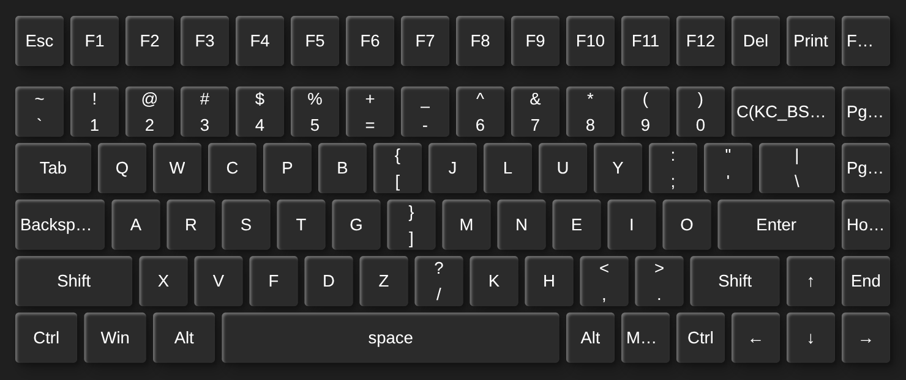

# 🛠️ System Dotfiles & Environment Configurations

Welcome to my personal developer environment configuration repository. This workspace contains my highly optimized system configurations, keyboard layouts, and development tools tailored for speed, ergonomic comfort, and performance automation.

## 🗂️ Repository Architecture

```text
dotfiles/
├── README.md              # This profile documentation file
├── manifest.scm           # Declarative GNU Guix manifest for user-level packages and toolchains
├── .zshrc                 # Shell configurations, aliases, and environment variables
├── kitty.conf             # GPU-accelerated terminal graphics and emulator properties
├── current-theme.conf     # Active terminal aesthetic syntax color palettes
├── config.el              # Literate Emacs package and feature configurations
├── init.el                # Emacs core initialization and custom runtime configurations
├── init.lua               # Neovim core startup logic and runtime setup
├── keybindings.json       # VSCodium customized global shortcut architectures
├── settings.json          # VSCodium core workspaces, telemetry settings, and syntax rules
└── Keymap-Keychron K3...  # Ergonomic Colemak-DH Wide physical mechanical keyboard layout
```

---

## ⚡ Core Ecosystems

### ❄️ Functional Package Infrastructure (GNU Guix)  
* **Guix (`manifest.scm`):** A purely functional, transactional package profile written in **GNU Guile Scheme**. It handles isolated, reproducible user-level binary deployments (like `ripgrep` and `htop`) inside an independent `/gnu/store/` matrix, completely isolating my development toolchains from Fedora's core system libraries.

### ⌨️ Layout Ergonomics (Colemak-DH Wide)
* **`Keymap-Keychron K3 Pro...json`:** A heavily customized layout optimized for low finger travel and mechanical efficiency. It deploys the **Colemak-DHv wide layout**, designed to reduce pinky strain and increase typing ergonomics during long terminal system management routines.
<div align="center">
  
</div>

### 🖥️ Terminal Emulator & Shell (Kitty + Zsh)
* **Kitty (`kitty.conf`, `current-theme.conf`):** A high-performance, GPU-accelerated console terminal configured with optimized line spacing, strict telemetry protections, and an active high-contrast theme.
* **Zsh (`.zshrc`):** Implements dynamic environment variable path bindings, automated shell completions, custom Git execution aliases, and interactive terminal utility scripting.

### 🔮 Text Editors & IDEs
* **Emacs (`init.el`, `config.el`):** My main configuration platform written in optimized **Elisp**. It handles advanced, literate document workflows and structural IDE automation.
* **Neovim (`init.lua`):** A lightweight, blazingly fast text rendering platform utilizing modern Lua configuration vectors for lightning-fast terminal-based file overrides and quick text corrections.
* **VSCodium (`settings.json`, `keybindings.json`):** A telemetry-free, telemetry-purged desktop coding framework rigged with matched keyboard macros to smooth out cross-platform development workflows.

---

## 🚀 Installation & Local Environment Sync

> [!WARNING]  
> Running installation steps indiscriminately will overwrite your active shell profile configuration arrays. Backup your system environment directories before symlinking tracking records.

To map these configurations into your active desktop environment profile directories:

```zsh
# 1. Clone the configuration workspace
git clone https://github.com ~/dotfiles

# 2. Link your core shell scripts
ln -sf ~/dotfiles/.zshrc ~/.zshrc

# 3. Mount terminal setups to the local system path
mkdir -p ~/.config/kitty
ln -sf ~/dotfiles/kitty.conf ~/.config/kitty/kitty.conf
ln -sf ~/dotfiles/current-theme.conf ~/.config/kitty/current-theme.conf

# 4. Synchronize package profiles and pull dependencies
guix pull && guix package --manifest=~/dotfiles/manifest.scm
```
